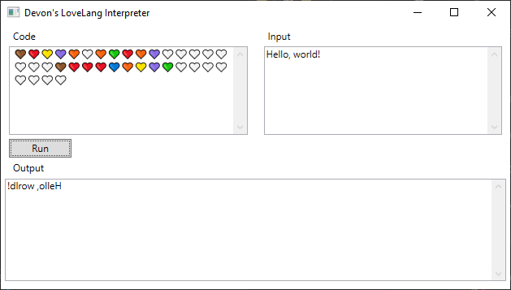

# LoveLang Interpreter

An interpreter for my own custom esoteric programming language called "LoveLang", where every operation and value is a heart emoji.

## How LoveLang works
You are given a set of cells to store data in, each cell being 8-bit. This interpreter has 4096 cells allocated, but I do not have a standard set, it can be whatever. You can move over a cell left or right, and if it goes out of bounds, you wrap around. There is also a temporary cell used for certain operations (i.e. add, subtract, AND, OR, XOR, compare, and bit shifting/rotation).

Numbers are used whenever being stored into the temp cell, or being used to jump to a label. A number is at max 8 bits. A number is stored as a series of black and white heart emojis in binary, with the black emoji representing a 0, and a white emoji representing a 1. It is terminated by the start of a new instruction. For example, 45 (101101) would be stored as 🤍🖤🤍🤍🖤🤍. Because numbers can also be signed (in two's complement), -1 (11111111) would be represented as 🤍🤍🤍🤍🤍🤍🤍🤍.

Jumping backwards to a nonexistent label will jump back to the start of the program. Likewise, jumping forwards to a nonexistent label will jump to the end of the program. The label offset stored in jump instructions are relative and signed, so storing 1 as the label offset will jump forward to the next label, storing 2 will jump forwards 2 labels, etc.

There are 3 conditional flags: zero, negative, and carry. Whenever a value is read/stored anywhere, the zero and negative flags are set according to the value itself. With operations involving a second value, the carry flag is also set based on if an overflow or underflow has occured. Bit rotation uses the carry flag as a 9th bit.

An input stream is also supported. Reading from the input stream reads 1 byte and stores it. If it has reached past the end of the input stream, the carry flag is set and nothing will be overwritten. Otherwise, the carry flag is cleared.

Any non-support character/emoji should be ignored and treated as a comment.

## Instruction set
* ❤️[NUM] - Copy number to temporary cell
* ❤️❤️ - Move 1 cell left
* ❤️🧡 - Move 1 cell right
* ❤️💛 - Read byte from input and store in cell
* ❤️💚 - Read byte from input and store in temporary cell
* ❤️💙 - Read byte from cell and store in output
* ❤️💜 - Read byte from temporary cell and store in output
* 🧡❤️ - Decrement cell
* 🧡🧡 - Increment cell
* 🧡💛 - Decrement temporary cell
* 🧡💚 - Increment temporary cell
* 🧡💙 - Copy from cell to temporary cell
* 🧡💜 - Copy from temporary cell to cell
* 💛❤️ - Shift temporary cell 1 bit left
* 💛🧡 - Shift temporary cell 1 bit right
* 💛💛 - Rotate temporary cell 1 bit left (9-bit rotation with carry flag)
* 💛💚 - Rotate temporary cell 1 bit right (9-bit rotation with carry flag)
* 💛💙 - Test cell
* 💛💜 - Test temporary cell
* 💚❤️ - Temporary cell + cell -> temporary cell
* 💚🧡 - Temporary cell - cell -> temporary cell
* 💚💛 - Compare temporary cell and cell (temporary cell - cell)
* 💚💚 - Temporary cell & cell -> temporary cell
* 💚💙 - Temporary cell | cell -> temporary cell
* 💚💜 - Temporary cell ^ cell -> temporary cell
* 💙❤️ - Cell + temporary cell -> cell
* 💙🧡 - Cell - temporary cell -> cell
* 💙💛 - Compare cell and temporary cell (cell - temporary cell)
* 💙💚 - Cell & temporary cell -> cell
* 💙💙 - Cell | temporary cell -> cell
* 💙💜 - Cell ^ temporary cell -> cell
* 💜[OFF] - Jump
* 💜❤️[OFF] - Jump if zero flag is set
* 💜🧡[OFF] - Jump if carry flag is set
* 💜💛[OFF] - Jump if negative flag is set
* 💜💚[OFF] - Jump if zero flag is clear
* 💜💙[OFF] - Jump if carry flag is clear
* 💜💜[OFF] - Jump if negative flag is clear
* 🤎 - Label

## Sample program
This sample program reads the input stream and outputs it in reverse order.

	🤎				         LABEL 1
	❤️💛				       READ FROM INPUT AND STORE IN CELL
	💜🧡🤍				     EXIT LOOP ONCE AT END OF INPUT STREAM
	🧡💚				       INCREMENT CHARACTER COUNT
	❤️🧡				       NEXT CELL
	💜🤍🤍🤍🤍🤍🤍🤍🤍	   LOOP UNTIL ALL CHARACTERS ARE READ
	
	🤎				         LABEL 2
	❤️❤️				       MOVE 1 CELL LEFT
	❤️💙				       READ FROM CELL AND STORE IN OUTPUT STREAM
	🧡💛				       DECREMENT CHARACTER COUNT
	💜💚🤍🤍🤍🤍🤍🤍🤍🤍	LOOP UNTIL ALL CHARACTERS ARE STREAMED TO OUTPUT
